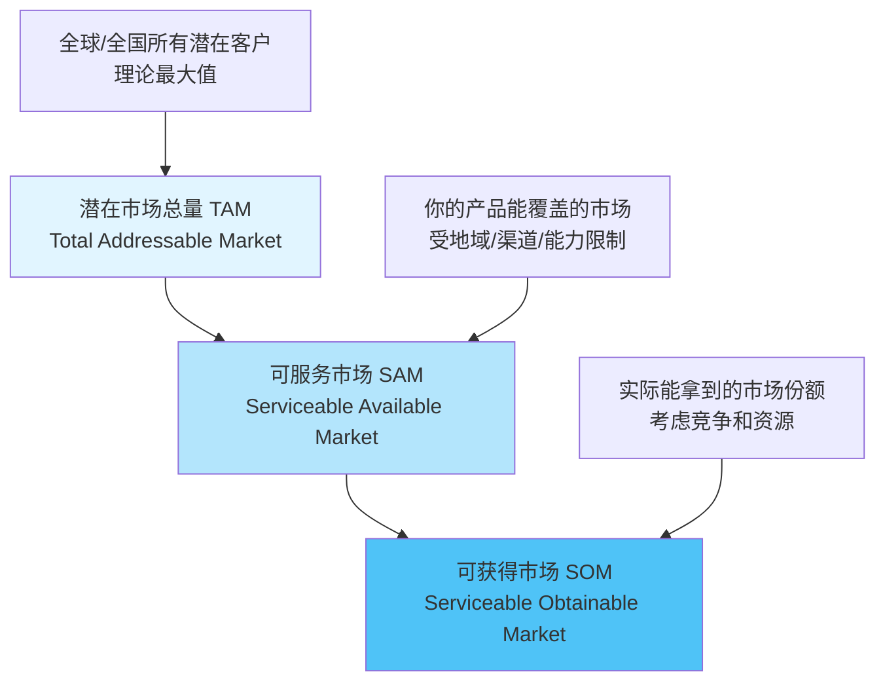
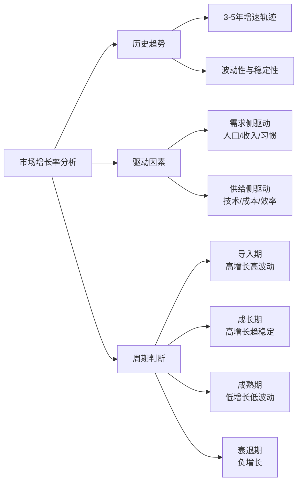
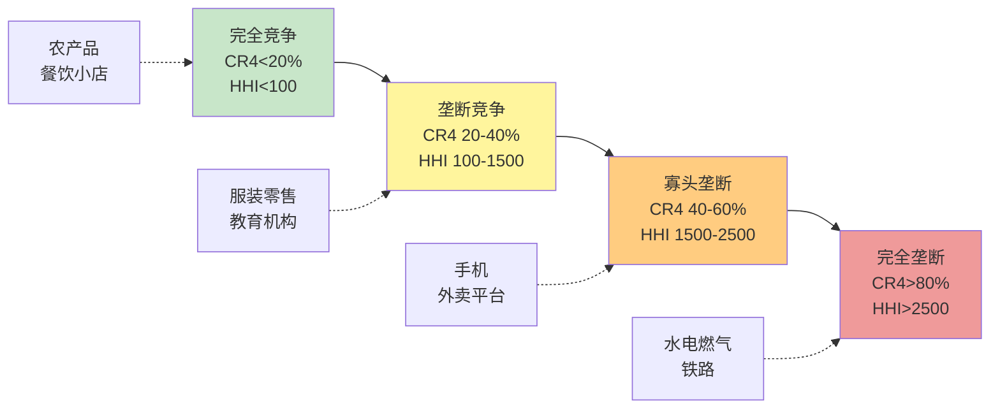
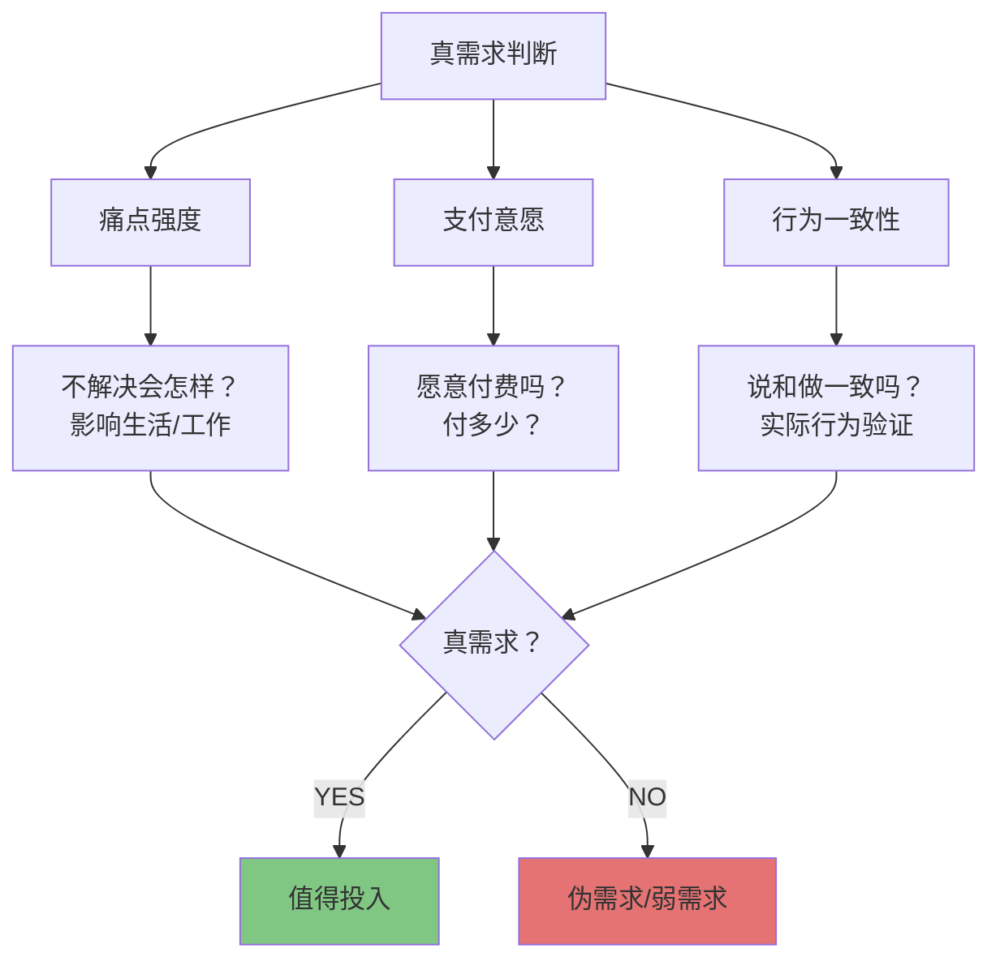
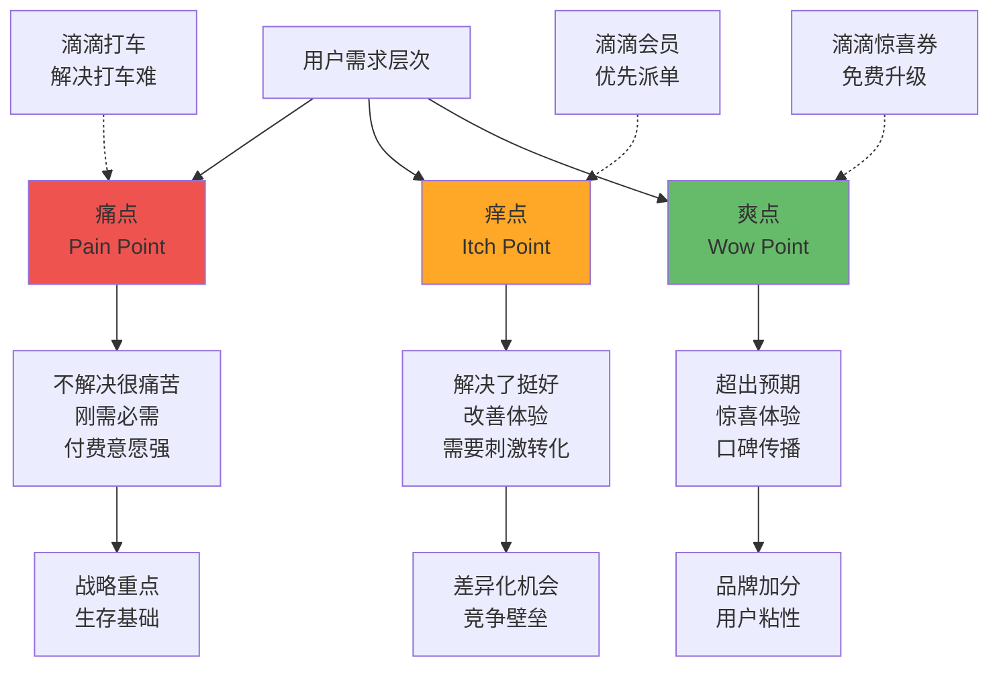
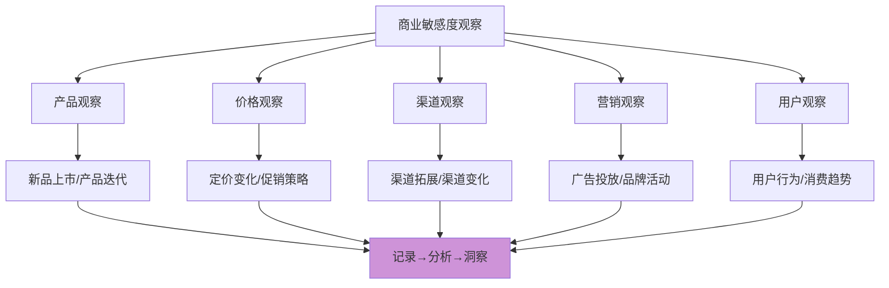
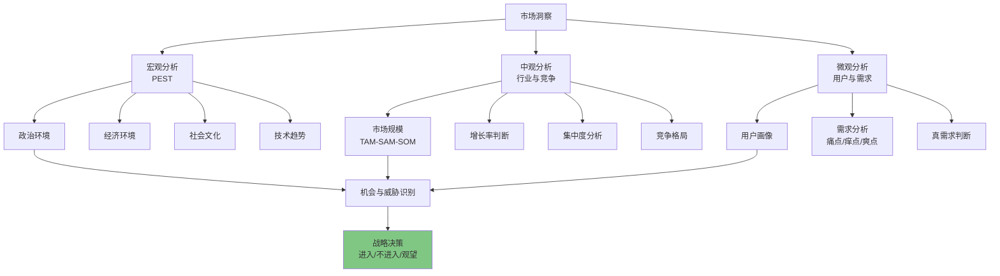
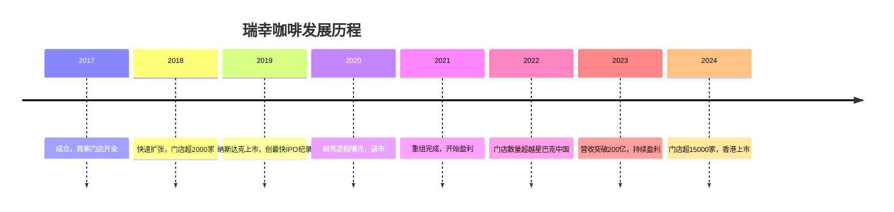
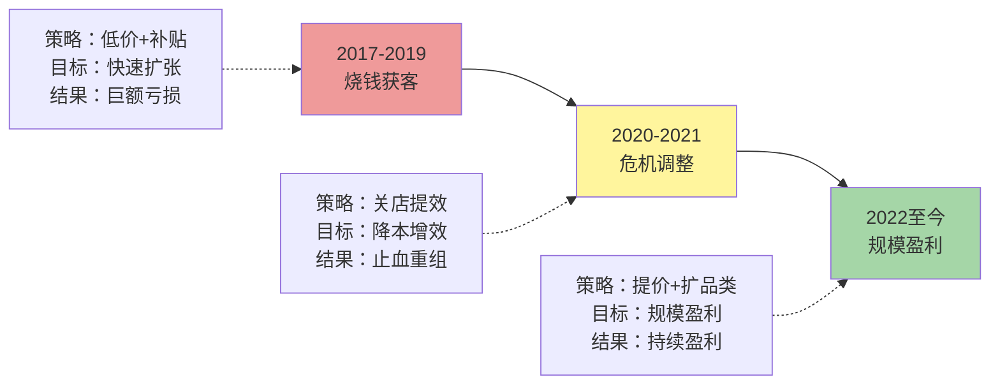
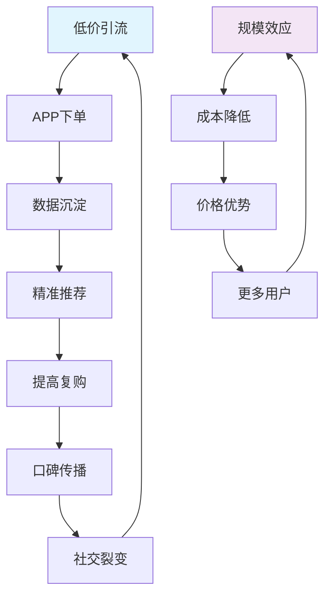

# 商业思维训练营：Day 9-10 完整课程材料

---

# Day 9: 市场洞察与商业敏感度

## 📋 学习目标

学完今天的内容，你将能够：

1. **掌握市场分析三维度**：能够独立进行市场规模估算、增长率判断和集中度分析
2. **识别真实需求**：建立用户洞察框架，区分真需求与伪需求
3. **培养商业敏感度**：掌握日常商业观察方法，形成持续学习的习惯
4. **整合前8天知识**：将商业模式、财务、战略等知识融合到市场洞察中

---

## 🎯 核心内容

### 一、市场分析三维度

#### 1.1 市场规模分析（TAM-SAM-SOM）

**定义框架：**

**计算方法：**

| 方法 | 适用场景 | 公式 | 示例 |
|------|----------|------|------|
| **自上而下法** | 有行业报告时 | 市场总量 × 细分占比 | 中国咖啡市场3000亿 × 即饮咖啡占20% = 600亿 |
| **自下而上法** | 无公开数据时 | 客户数 × 客单价 × 购买频次 | 1000万白领 × 25元/杯 × 200杯/年 = 500亿 |
| **类比法** | 新兴市场 | 参照类似市场推算 | 中国奶茶市场 → 预估果茶市场规模 |

**实战案例：中国现磨咖啡市场**

**TAM计算（自上而下）：**
- 中国餐饮市场规模：5万亿
- 饮品占比：15% → 7500亿
- 咖啡占饮品比例：8% → 600亿
- 现磨咖啡占咖啡市场：50% → **300亿（TAM）**

**SAM计算（可服务市场）：**
- 一二线城市覆盖：300亿 × 70% = 210亿
- 线上外卖渠道：210亿 × 40% = **84亿（你的SAM）**

**SOM计算（可获得市场）：**
- 目标市场份额：5%
- **SOM = 84亿 × 5% = 4.2亿**

**❗ 常见误区：**

1. **混淆TAM与SAM**：把理论最大值当成实际能做的市场
2. **忽视增长阶段**：静态计算，不考虑市场增速
3. **过度乐观估算**：SOM预期过高，忽视竞争壁垒
4. **缺乏数据支撑**：凭感觉拍脑袋，缺乏逻辑链条

#### 1.2 市场增长率判断

**判断维度：**

**增长率判断表：**

| 增长率 | 市场阶段 | 投资建议 | 典型行业 |
|--------|----------|----------|----------|
| >30% | 快速成长期 | 积极进入，抢占份额 | 新能源汽车、AI应用 |
| 15-30% | 稳定成长期 | 选择性进入，需差异化 | 咖啡、宠物经济 |
| 5-15% | 成熟期 | 谨慎进入，需成本优势 | 餐饮、零售 |
| 0-5% | 衰退前期 | 避免进入或寻找细分 | 传统百货 |
| <0% | 衰退期 | 退出或转型 | 纸媒、传统出租车 |

**驱动因素分析框架：**

**需求侧驱动因素：**
- 人口结构变化（老龄化 → 医疗市场增长）
- 收入水平提升（中产崛起 → 消费升级）
- 生活方式改变（健康意识 → 有机食品市场）
- 文化趋势演变（国潮兴起 → 国货品牌）

**供给侧驱动因素：**
- 技术突破（5G → 云游戏市场）
- 成本下降（电池成本降 → 电动车普及）
- 效率提升（SaaS工具 → 企业数字化市场）
- 模式创新（订阅制 → 知识付费市场）

#### 1.3 市场集中度分析

**集中度指标：**

| 指标 | 含义 | 计算方法 | 竞争格局判断 |
|------|------|----------|--------------|
| **CR4** | 前4名市场份额 | Σ(Top 4企业份额) | >60%寡头垄断，<40%竞争分散 |
| **CR8** | 前8名市场份额 | Σ(Top 8企业份额) | >70%高度集中，<50%分散竞争 |
| **HHI** | 赫芬达尔指数 | Σ(各企业份额²) | >2500高度集中，<1500分散 |

**市场结构图谱：**

**集中度对策略的影响：**

| 集中度 | 进入难度 | 定价权 | 策略重点 | 典型案例 |
|--------|----------|--------|----------|----------|
| 低分散 | 低 | 弱 | 差异化、品牌、区域深耕 | 美容美发 |
| 中等 | 中 | 中等 | 成本领先、快速扩张 | 连锁餐饮 |
| 高集中 | 高 | 强 | 寻找细分、收购整合 | 手机市场 |

**集中度演变趋势：**

**上升信号：**
- 规模效应显现（制造业、物流）
- 网络效应增强（平台型业务）
- 监管准入提高（金融、医疗）
- 并购活动增加

**下降信号：**
- 技术民主化（降低进入门槛）
- 细分需求分化（长尾市场）
- 监管反垄断（平台拆分）
- 消费者追求多样性

---

### 二、用户洞察与需求分析

#### 2.1 真需求 vs 伪需求判断框架

**真需求的特征：**

**判断清单：**

| 维度 | 真需求 | 伪需求 | 验证方法 |
|------|--------|--------|----------|
| **痛点强度** | 不解决很难受 | 解决了也无所谓 | 用户访谈、观察 |
| **支付意愿** | 愿意付费，有预算 | 喜欢但不付费 | 定价测试、预售 |
| **使用频率** | 高频刚需 | 低频可有可无 | 使用数据统计 |
| **替代方案** | 现有方案很痛苦 | 现有方案够用 | 竞品分析 |
| **行为验证** | 实际行为支持 | 口头说说而已 | A/B测试、MVP |
| **场景真实** | 有明确场景 | 场景虚构 | 实地调研 |

**经典案例：伪需求的识别**

| 案例 | 用户说法 | 真实情况 | 判断 |
|------|----------|----------|------|
| **智能水杯** | 想喝温水，不想总烧水 | 多烧一壶水就行，成本几毛钱 | 弱需求，产品卖不动 |
| **宠物社交App** | 想让宠物交朋友 | 遛狗时线下交流就够了 | 伪需求，没有持续使用 |
| **生鲜电商** | 想买新鲜水果 | 线下超市已很方便 | 需求存在，但价值主张需差异化 |

#### 2.2 痛点/痒点/爽点分析

**三层需求模型：**

**分析框架表：**

| 需求类型 | 特征 | 产品策略 | 商业模式 | 案例 |
|----------|------|----------|----------|------|
| **痛点** | 必须解决，否则流失 | 核心功能，做扎实 | 直接收费/订阅 | 扫码支付（解决找零痛点） |
| **痒点** | 锦上添花，提升体验 | 增值功能，做精细 | 增值服务/会员 | 支付积分（痒点） |
| **爽点** | 超出预期，制造惊喜 | 创新功能，做极致 | 口碑传播/裂变 | 支付红包（爽点） |

**需求优先级矩阵：**

| | 痛点强度高 | 痛点强度低 |
|---|:---:|:---:|
| **高频** | 优先级最高 核心功能 （如：通勤打车） | 持续优化 用户粘性 （如：资讯推送） |
| **低频** | 保留功能 特定场景 （如：搬家服务） | 可选功能 锦上添花 （如：主题皮肤） |

#### 2.3 用户画像模板

**标准用户画像框架：**

**一、基础属性**
- 姓名：[虚构典型用户名]
- 年龄：[年龄段]
- 职业：[职业类型]
- 收入：[收入区间]
- 地域：[城市/区域]
- 家庭：[婚姻/子女状况]

**二、行为特征**
- 生活作息：[日常时间安排]
- 消费习惯：[消费偏好、渠道]
- 信息获取：[主要信息渠道]
- 社交行为：[社交平台、频率]

**三、心理特征**
- 价值观：[核心价值取向]
- 痛点焦虑：[最担心的事]
- 向往目标：[理想状态]
- 决策驱动：[购买决策的关键因素]

**四、场景故事**
- 时间：[什么时候用]
- 地点：[在哪儿用]
- 任务：[要完成什么]
- 情绪：[当时的心情]
- 障碍：[遇到的困难]
- 期望：[希望的结果]

**五、产品需求**
- 核心需求：[必须解决的问题]
- 期望功能：[想要的功能]
- 预算范围：[愿意付多少钱]
- 决策周期：[多久会决定购买]

---

**实战案例：精品咖啡用户画像**

| 维度 | 内容 |
|------|------|
| **姓名** | 小雅 |
| **年龄** | 28-32岁 |
| **职业** | 互联网产品经理 |
| **收入** | 月入1.5-2.5万 |
| **地域** | 一线城市（北京/上海/深圳） |
| **家庭** | 单身或恋爱中 |
| **生活作息** | 早9晚9，周末休息 |
| **消费习惯** | 注重品质，愿为体验付费 |
| **信息渠道** | 小红书、微信、播客 |
| **社交行为** | 朋友圈分享，重视社交货币 |
| **价值观** | 生活品质>省钱，体验>物质 |
| **痛点焦虑** | 工作压力大，需要小确幸 |
| **向往目标** | 精致生活方式，有品味 |
| **决策驱动** | 品牌调性>价格，口碑>广告 |

**典型场景：**
- 早晨8:30，地铁站附近买咖啡
- 下午3:00，办公室续命咖啡
- 周末下午，咖啡店办公/社交

**产品需求：**
- 核心需求：提神+品质+社交货币
- 期望功能：外卖快、包装美、有格调
- 预算范围：单杯25-40元，月均500-800元
- 决策周期：快消品，即时决策

---

**用户分群矩阵：**

| 分群维度 | 高价值用户 | 潜力用户 | 大众用户 |
|----------|------------|----------|----------|
| **消费频次** | 高（每天） | 中（每周2-3次） | 低（偶尔） |
| **客单价** | 高 | 中 | 低 |
| **品牌忠诚** | 高 | 中 | 低 |
| **口碑影响** | 强 | 中 | 弱 |
| **服务策略** | VIP服务、定制 | 会员权益、促活 | 优惠促销、转化 |
| **获客成本** | 维护成本低 | 需培养投入 | 获客成本高 |

---

### 三、商业敏感度培养

#### 3.1 商业观察方法

**日常观察框架：**

**观察记录模板：**

**商业观察日记**

**日期**：YYYY-MM-DD

**观察对象**：[公司/产品/现象]

**观察内容**
- 看到了什么？（现象描述）
- 有什么变化？（前后对比）

**商业分析**
- 为什么这么做？（战略意图）
- 影响是什么？（对用户/行业/自身）

**我的判断**
- 预测未来会怎样？
- 对我有什么启发？

**行动计划**
- 我可以学习什么？
- 如何应用到自己的工作中？

---

**观察维度清单：**

| 观察类型 | 具体内容 | 关注点 | 举例 |
|----------|----------|--------|------|
| **产品观察** | 功能迭代、新品发布 | 用户需求变化、技术趋势 | 咖啡品牌推出0糖系列 |
| **价格观察** | 定价调整、促销策略 | 竞争态势、成本变化 | 会员涨价、限时折扣 |
| **渠道观察** | 线上线下变化 | 渠道效率、用户习惯 | 直播带货、社区团购 |
| **营销观察** | 广告投放、品牌联名 | 品牌定位、目标人群 | 咖啡×奢侈品联名 |
| **竞争观察** | 对手动作、新进入者 | 行业格局、机会威胁 | 新品牌入局咖啡市场 |
| **用户观察** | 消费行为变化 | 需求演变、趋势洞察 | 年轻人喜欢"国潮" |

#### 3.2 商业敏感度自测表

**自测问卷（满分100分）：**

| 维度 | 评分项 | 分值 | 自评 |
|------|--------|------|------|
| **信息摄入**（20分） | | | |
| | 每周阅读商业新闻≥3篇 | 5 | |
| | 关注行业报告和数据分析 | 5 | |
| | 了解主要竞争对手动态 | 5 | |
| | 跨行业学习，不局限于本行业 | 5 | |
| **分析能力**（25分） | | | |
| | 能快速判断商业模式核心 | 5 | |
| | 能分析产品背后的用户需求 | 5 | |
| | 能评估市场规模和机会 | 5 | |
| | 能识别竞争优势和壁垒 | 5 | |
| | 能预测行业发展趋势 | 5 | |
| **实践应用**（25分） | | | |
| | 工作中应用商业框架 | 5 | |
| | 主动做商业分析和复盘 | 5 | |
| | 能提出有效的商业建议 | 5 | |
| | 商业决策的成功率较高 | 5 | |
| | 能识别商业机会和风险 | 5 | |
| **敏感度**（30分） | | | |
| | 能快速发现异常/机会信号 | 6 | |
| | 对价格变化敏感 | 6 | |
| | 能洞察用户心理和动机 | 6 | |
| | 能发现隐藏的商业模式 | 6 | |
| | 有"商业嗅觉"直觉 | 6 | |
| **总分** | | **100** | |

**评分解读：**

| 分数段 | 商业敏感度水平 | 建议 |
|--------|----------------|------|
| 80-100 | 优秀 | 继续深化，可向战略/投资方向发展 |
| 60-79 | 良好 | 系统学习，多做案例分析 |
| 40-59 | 一般 | 加强基础，培养日常观察习惯 |
| <40 | 需提升 | 从基础概念开始，循序渐进 |

#### 3.3 日常训练计划

**30天商业敏感度训练计划：**

**第1周：信息输入周**
- Day 1-2：关注5个商业媒体账号
- Day 3-4：阅读3篇行业深度分析
- Day 5-6：学习1个新商业模式案例
- Day 7：总结本周收获，写观察日记

**第2周：产品观察周**
- Day 8-9：分析1个新上市产品
- Day 10-11：对比分析2个竞品
- Day 12-13：访谈3个用户，了解需求
- Day 14：输出产品分析报告

**第3周：价格与渠道周**
- Day 15-16：观察3个品牌的定价策略
- Day 17-18：分析1个成功渠道案例
- Day 19-20：实地调研2个线下门店
- Day 21：输出渠道分析报告

**第4周：综合分析周**
- Day 22-24：选择1个行业做完整分析
- Day 25-26：分析1家公司的商业模式
- Day 27-28：预测行业未来3年趋势
- Day 29-30：输出个人商业洞察报告

---

**每日5分钟训练：**

| 时间段 | 训练内容 |
|--------|----------|
| **早晨（1分钟）** | 浏览商业新闻标题，选择1个感兴趣的话题 |
| **通勤路上（2分钟）** | 思考：这个现象背后的商业逻辑是什么？ |
| **午休（1分钟）** | 观察：身边人的消费行为有什么特点？ |
| **晚上（1分钟）** | 记录：今天看到的1个商业现象+我的判断 |

---

## 📊 综合分析框架：市场洞察整合

**市场洞察全流程：**

**与前期知识整合：**

| Day 1-8知识模块 | 在市场洞察中的应用 |
|-----------------|-------------------|
| **商业模式**（Day 1-2） | 分析市场机会，设计商业模式 |
| **财务分析**（Day 3-4） | 评估市场规模，计算潜在收益 |
| **用户思维**（Day 5-6） | 用户洞察，需求分析 |
| **竞争战略**（Day 7-8） | 竞争格局分析，战略选择 |

---

## 💪 练习任务

### 任务一：市场规模估算（30分钟）

选择一个你感兴趣的市场（如：宠物经济、预制菜、露营装备），完成：

1. 用自上而下法估算TAM
2. 计算你的SAM和SOM
3. 分析市场增长率
4. 判断市场集中度
5. 给出你的进入建议

### 任务二：需求真伪判断（30分钟）

分析以下3个"需求"，判断是真需求还是伪需求：

1. **智能猫砂盆**：自动清理猫砂，主人不用动手
2. **共享雨伞**：下雨时扫码租伞，用完归还
3. **虚拟试衣间**：AR试穿衣服，减少退货

对每个需求，回答：
- 痛点有多强？
- 用户有付费意愿吗？
- 实际行为如何验证？
- 你的结论和理由

### 任务三：用户画像绘制（30分钟）

为你熟悉的一个产品（如：瑞幸咖啡、小红书、B站）绘制典型用户画像：

1. 基础属性（5项）
2. 行为特征（4项）
3. 心理特征（4项）
4. 典型场景故事（1个）
5. 产品需求清单

### 任务四：商业观察日记（15分钟）

记录最近一周你观察到的1个商业现象：

- 你看到了什么？
- 你觉得为什么会这样？
- 你预测未来会怎样？
- 对你有什么启发？

---

## 📚 推荐资源

### 必读书籍

1. **《创新者的窘境》** - 克莱顿·克里斯坦森
   - 重点章节：市场需求与技术变革
   - 理解为什么大公司会错过新机会

2. **《蓝海战略》** - W.钱·金
   - 重点章节：价值创新框架
   - 学会找到无人竞争的新市场

3. **《定位》** - 艾·里斯、杰克·特劳特
   - 重点章节：心智定位
   - 理解如何在用户心智中占据位置

4. **《精益创业》** - 埃里克·莱斯
   - 重点章节：MVP与需求验证
   - 学会如何低成本验证需求

### 行业报告来源

| 报告来源 | 特点 | 网址 |
|----------|------|------|
| 艾瑞咨询 | 互联网行业为主 | iresearch.com.cn |
| 易观分析 | 用户行为洞察 | analysys.cn |
| QuestMobile | 移动互联网数据 | questmobile.com.cn |
| 麦肯锡中国 | 宏观与消费洞察 | mckinsey.com.cn |
| 贝恩公司 | 消费品行业 | bain.com.cn |
| 国家统计局 | 宏观数据 | stats.gov.cn |

### 实用工具

**市场规模估算工具：**
- Excel/Google Sheets - 建立计算模型
- Statista - 全球市场数据
- IT桔子 - 创投数据

**用户研究工具：**
- 问卷星 - 在线问卷
- 用户访谈 - 深度洞察
- 神策数据 - 用户行为分析

**竞品分析工具：**
- 七麦数据 - App数据
- SimilarWeb - 网站流量
- 天眼查 - 企业信息

---

## ✅ 今日检验清单

完成以下问题，检验你的学习成果：

### 知识掌握（10题）

1. TAM、SAM、SOM分别代表什么？计算时有什么区别？

2. 判断市场增长率时，需要考虑哪些驱动因素？

3. CR4和HHI指数如何判断市场集中度？

4. 真需求和伪需求有什么区别？如何验证？

5. 痛点、痒点、爽点分别对应什么产品策略？

6. 用户画像包含哪些核心要素？

7. 商业敏感度包含哪些维度？

8. 日常商业观察可以从哪几个维度进行？

9. 如何判断一个市场是否值得进入？

10. 市场洞察如何与商业模式分析结合？

### 能力应用（3题）

11. 给你一个新市场（如：老年健康管理），你会如何分析其市场机会？

12. 如果有人说"大家都需要这个功能"，你会如何判断这是否是真需求？

13. 如何通过日常观察培养商业敏感度？请举一个具体例子。

### 思考题（开放）

14. 你认为当前哪个行业存在"伪需求"泡沫？为什么？

15. 结合你所在行业，分析一个用户的"痛点"和"爽点"分别是什么。

---

# Day 10: 综合案例复盘与毕业任务

## 📋 学习目标

学完今天的内容，你将能够：

1. **综合应用所有框架**：用10天所学完整分析一个商业案例
2. **系统梳理知识体系**：建立完整的商业思维框架
3. **评估自身能力**：识别优势与不足，制定提升计划
4. **完成毕业报告**：独立完成一份商业分析报告

---

## 🎯 核心内容

### 一、瑞幸咖啡完整案例分析

#### 1.1 案例背景

**瑞幸咖啡发展时间线：**

**关键数据：**

| 指标 | 2019年 | 2021年 | 2023年 | 变化趋势 |
|------|--------|--------|--------|----------|
| 门店数 | 4,507 | 6,024 | 16,218 | 快速增长 |
| 营收（亿） | 30.3 | 79.7 | 249.0 | 爆发式增长 |
| 门店经营利润率 | -61.5% | 6.7% | 29.5% | 持续改善 |
| 月均交易用户（万） | 440 | 1,418 | 5,840 | 高速增长 |
| 单杯价格 | 10.8元 | 15.2元 | 16.5元 | 稳中有升 |

#### 1.2 商业模式分析

**商业模式画布（Day 1-2知识应用）：**

| 模块 | 内容 |
|------|------|
| **核心伙伴** | 供应商合作、写字楼物业、外卖平台、IT服务商 |
| **关键业务** | 快速开店、数字化运营、品牌营销、产品研发 |
| **核心资源** | 品牌影响力、数字化系统、供应链网络、门店网络 |
| **价值主张** | 高性价比咖啡、便捷购买体验、新口味创新、社交货币属性 |
| **客户关系** | 自助下单、会员体系、私域运营 |
| **渠道通路** | APP/小程序、外卖平台、线下门店 |
| **客户细分** | 都市白领、年轻消费者、价格敏感人群 |
| **成本结构** | 原材料成本、门店租金、人员成本、营销费用 |
| **收入来源** | 饮品销售、会员订阅、周边产品、联名合作 |

**商业模式核心创新：**

| 创新点 | 传统模式 | 瑞幸模式 | 价值创造 |
|--------|----------|----------|----------|
| **选址** | 商圈黄金位置 | 写字楼/学校 | 降低租金成本50%+ |
| **点单** | 柜台点单 | APP下单 | 提高效率，数据沉淀 |
| **支付** | 现金/刷卡 | 移动支付 | 降低交易成本 |
| **营销** | 传统广告 | 社交裂变 | 获客成本降低70% |
| **会员** | 积分卡 | 数字化会员 | 提高复购率 |

**盈利模式演变：**

#### 1.3 增长策略分析

**用户增长飞轮（Day 7-8知识应用）：**

**增长策略分解：**

**第一阶段：裂变获客（2017-2019）**

| 策略 | 具体做法 | 效果 |
|------|----------|------|
| 首杯免费 | 新用户注册送免费咖啡 | 快速拉新 |
| 拉新奖励 | 邀请好友双方各得一杯 | 病毒式传播 |
| 疯狂补贴 | 首杯1.8折起 | 打破价格认知 |
| 网红营销 | KOL打卡种草 | 社交货币化 |

**第二阶段：留存变现（2020-2022）**

| 策略 | 具体做法 | 效果 |
|------|----------|------|
| 会员体系 | 月卡、季卡、年卡 | 提高复购频次 |
| 价格回归 | 逐步提价至15-20元 | 改善盈利能力 |
| 品类扩展 | 茶、轻食、周边 | 提高客单价 |
| 精准营销 | 基于数据的个性化推荐 | 提升转化率
**第三阶段：规模盈利（2023至今）**

| 策略 | 具体做法 | 效果 |
|------|----------|------|
| 持续开店 | 年增3000+门店 | 规模效应增强 |
| 产品创新 | 生椰拿铁、酱香拿铁 | 打造爆款 |
| 供应链优化 | 自建烘焙工厂 | 降低成本 |
| 品牌升级 | 香港上市、国际化 | 提升品牌力 |

---

## 📋 配套练习

### 练习1：市场分析

选择一个你熟悉的行业，完成：
1. 市场规模估算（TAM-SAM-SOM）
2. 市场集中度分析
3. 增长驱动因素

### 练习2：用户需求分析

针对一个你常用的产品，分析：
1. 用户的痛点、痒点、爽点
2. 哪些是真需求，哪些是伪需求？
3. 如何验证？

### 练习3：商业敏感度训练

每天完成一篇商业观察日记：
- 观察一个商业现象
- 分析其背后的逻辑
- 推演可能的商业机会

---

## 📚 推荐资源

### 书籍
- 《创新者的窘境》克莱顿·克里斯坦森
- 《从0到1》彼得·蒂尔
- 《精益创业》埃里克·莱斯
- 《增长黑客》肖恩·埃利斯

### 网站
- 36氪、虎嗅、晚点LatePost
- 行业研究报告（艾瑞、易观）

---

## ✅ Day 9-10 检验清单

完成以下检验，确认你已掌握核心内容：

- [ ] 能估算市场规模（TAM-SAM-SOM）
- [ ] 能判断真假需求
- [ ] 理解商业敏感度的培养方法
- [ ] 能完成完整的商业案例分析

---

# 🎓 毕业任务

## 综合商业分析报告

**任务要求：**
选择一家你感兴趣的公司，完成一份完整的商业分析报告（3000-5000字）

**报告结构：**

1. 公司概况（基本信息、发展历程、核心业务）
2. 市场分析（市场规模、竞争格局、行业趋势）
3. 商业模式分析（商业模式画布、核心竞争力、护城河）
4. 增长策略分析（用户获取、用户留存、商业化路径）
5. 风险评估（核心风险、应对策略）
6. 投资建议（优势与劣势、投资逻辑、关注要点）

**评分标准：**

| 维度 | 分值 | 评分要点 |
|------|------|----------|
| 结构完整性 | 20分 | 六个部分完整 |
| 分析深度 | 30分 | 运用所学框架 |
| 数据支撑 | 20分 | 数据来源可靠 |
| 逻辑清晰 | 20分 | 论证合理 |
| 语言表达 | 10分 | 语言流畅 |

---

# 🎊 课程总结

## 10天学习回顾

| 天数 | 主题 | 核心收获 |
|------|------|----------|
| Day 1-2 | 商业底层逻辑 | 第一性原理、商业三环节、思维模型 |
| Day 3-4 | 核心商业理论 | 波特五力、护城河、网络效应、商业模式画布 |
| Day 5-6 | 经典案例分析 | 7个公司案例深度拆解 |
| Day 7-8 | 实战技能训练 | 行业研究、财务分析、谈判、决策 |
| Day 9-10 | 综合实践 | 市场洞察、商业敏感度、毕业任务 |

## 持续学习建议

1. **每日观察**：养成商业观察习惯
2. **每周分析**：深入研究一个公司或行业
3. **每月复盘**：总结学习成果，调整方向

## 结语

商业思维不是一蹴而就的，需要持续学习和实践。10天的课程只是一个起点，真正的商业洞察力来自于：

- 持续的好奇心
- 系统的思维框架
- 丰富的案例积累
- 敏锐的观察习惯

**祝你商业思维不断精进！** 🚀

---

*商业思维10天实战课程 - 完整版*
*版本：2.0*
